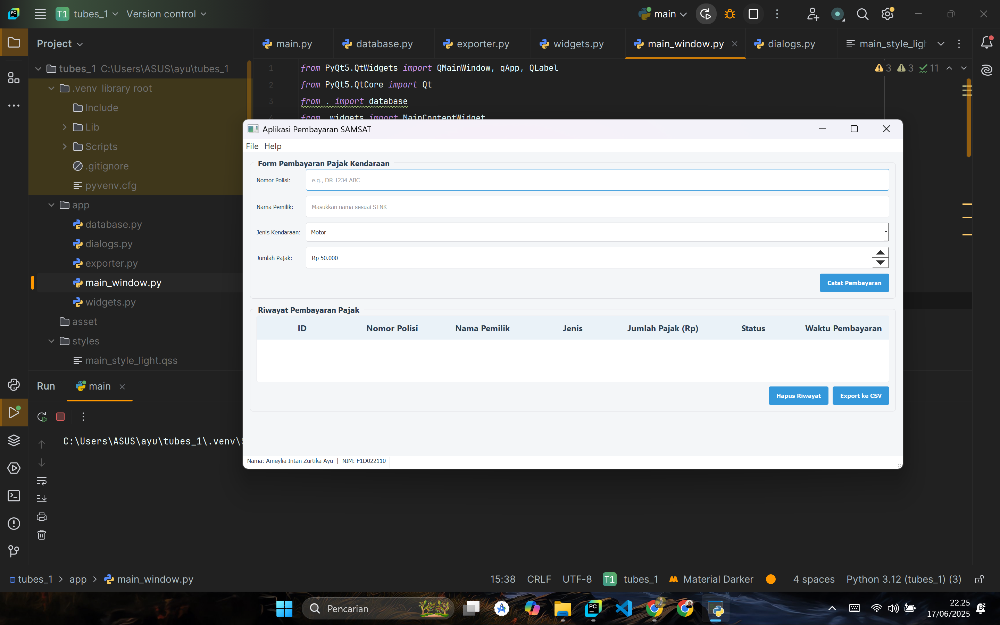
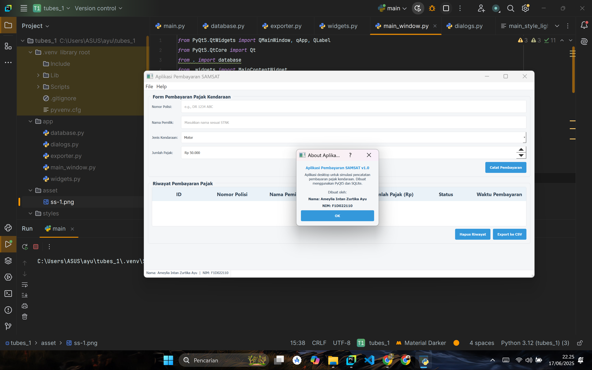
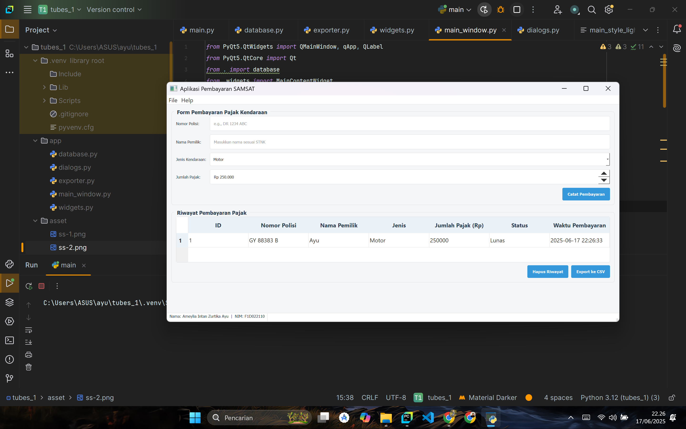

# Aplikasi Simulasi Pembayaran SAMSAT

Aplikasi desktop ini merupakan simulasi untuk pencatatan pembayaran pajak kendaraan bermotor (SAMSAT). Dibuat sebagai proyek akademis menggunakan Python dengan library PyQt5, aplikasi ini menyediakan antarmuka grafis untuk mengelola data pembayaran secara efisien.

## Daftar Isi
- [Deskripsi Aplikasi](#deskripsi-aplikasi)
- [Fitur Utama](#fitur-utama)
- [Tangkapan Layar](#tangkapan-layar)
- [Proses Pembangunan](#proses-pembangunan)
- [Fungsi Utama](#fungsi-utama)
- [Cara Menjalankan](#cara-menjalankan)

## Deskripsi Aplikasi
Topik aplikasi adalah **Simulasi Pencatatan Pembayaran SAMSAT Kendaraan**. Aplikasi ini dirancang untuk mempermudah petugas dalam mencatat setiap transaksi pembayaran pajak tahunan kendaraan. Pengguna dapat memasukkan data kendaraan, memproses pembayaran, dan melihat riwayat transaksi yang tersimpan secara lokal dalam database SQLite.

## Fitur Utama
- **Pencatatan Transaksi**: Form input yang lengkap untuk mencatat detail pembayaran, termasuk Nomor Polisi, Nama Pemilik, Jenis Kendaraan, dan Jumlah Pajak.
- **Manajemen Riwayat**: Kemampuan untuk menambah dan menghapus data riwayat pembayaran.
- **Tampilan Riwayat**: Seluruh data riwayat pembayaran ditampilkan dalam tabel yang terstruktur dan mudah dibaca.
- **Ekspor Data**: Fungsi untuk mengekspor semua data riwayat ke dalam format file `.csv` untuk keperluan arsip atau pelaporan.
- **Antarmuka Pengguna Kustom**: Menggunakan stylesheet (QSS) eksternal untuk menciptakan tampilan yang bersih, modern, dan profesional.
- **Identitas Pembuat**: Menampilkan Nama dan NIM pembuat pada bagian status bar aplikasi.

## Tangkapan Layar

Berikut adalah tangkapan layar dari antarmuka aplikasi.








## Proses Pembangunan
Proses pembuatan aplikasi ini mengikuti tahapan berikut:
1.  **Perancangan Konsep**: Menentukan alur kerja aplikasi pembayaran SAMSAT dan data apa saja yang perlu dicatat (No. Polisi, Pemilik, Jenis, Jumlah Pajak, dll.).
2.  **Desain Database**: Merancang skema tabel `riwayat_pembayaran` di SQLite. Kolom `nomor_polisi` diatur sebagai `UNIQUE` untuk mencegah pencatatan ganda dalam satu sesi.
3.  **Inisialisasi Proyek**: Membangun struktur folder dan file dasar sesuai dengan desain arsitektur modular.
4.  **Pengembangan Antarmuka (UI)**: Membuat widget di `widgets.py` menggunakan `QGroupBox` untuk form pembayaran dan tabel riwayat. Komponen yang digunakan antara lain `QLineEdit`, `QComboBox` untuk jenis kendaraan, dan `QSpinBox` untuk input jumlah pajak yang numerik.
5.  **Implementasi Logika Backend**: Menulis semua fungsi interaksi database di `database.py`, seperti `init_db`, `add_payment`, `get_all_payments`, dan `delete_payment`.
6.  **Integrasi Frontend dan Backend**: Menghubungkan aksi dari antarmuka (misalnya, klik tombol "Catat Pembayaran") ke fungsi yang sesuai di backend.
7.  **Styling**: Menerapkan file `main_style_light.qss` untuk memberikan tampilan visual yang konsisten dan profesional pada aplikasi.
8.  **Fitur Pelengkap**: Mengimplementasikan fungsi ekspor ke CSV dan dialog "About".
9.  **Pengujian dan Finalisasi**: Menguji semua fungsionalitas, mulai dari input data, penghapusan, hingga ekspor, untuk memastikan aplikasi berjalan dengan stabil.

## Fungsi Utama
Aplikasi ini didukung oleh beberapa fungsi inti:

- **`database.py`**:
    - `init_db()`: Membuat file database dan tabel `riwayat_pembayaran` saat aplikasi dijalankan pertama kali.
    - `add_payment(...)`: Menyimpan catatan pembayaran baru ke dalam database. Fungsi ini juga menangani kemungkinan error jika data dengan Nomor Polisi yang sama coba dimasukkan lagi.
    - `delete_payment(payment_id)`: Menghapus sebuah data riwayat pembayaran berdasarkan ID yang dipilih dari tabel.

- **`widgets.py`**:
    - `add_new_payment()`: Mengambil nilai dari semua input form, melakukan validasi sederhana, dan memanggil fungsi `database.add_payment()` untuk menyimpan data.
    - `delete_selected_payment()`: Menampilkan dialog konfirmasi sebelum menghapus data. Jika pengguna setuju, fungsi ini akan memanggil `database.delete_payment()` untuk menghapus data dari database.
    - `setup_database_model()`: Mengkonfigurasi `QSqlTableModel` sebagai perantara antara tabel `riwayat_pembayaran` di SQLite dengan `QTableView` di antarmuka.

- **`main_window.py`**:
    - `_create_menu_bar()` dan `_create_status_bar()`: Membangun elemen-elemen standar jendela aplikasi, termasuk menu dan baris status yang menampilkan identitas pembuat.
    - `_load_stylesheet()`: Membaca file `.qss` dan mengaplikasikannya ke seluruh jendela aplikasi.

## Cara Menjalankan
1.  Pastikan Anda memiliki **Python 3** dan `pip` terinstal.
2.  Buka terminal dan arahkan ke direktori utama proyek ini.
3.  Instal semua dependensi yang dibutuhkan dengan perintah:
    ```bash
    pip install PyQt5 PyQt5-Qt5 PyQt5-sip
    ```
4.  Jalankan aplikasi utama:
    ```bash
    python main.py
    ```

---
Dibuat oleh **Ameylia Intan Zurtika Ayu (F1D022110)**